Results for 'tritanope'
-------

Ishihara_03
---

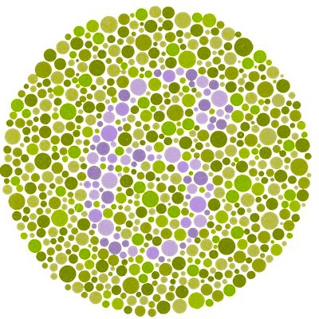
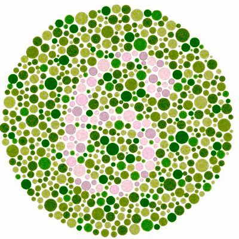
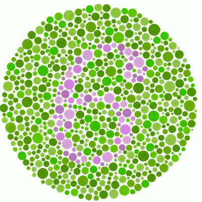
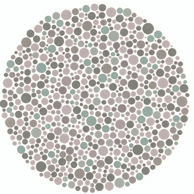
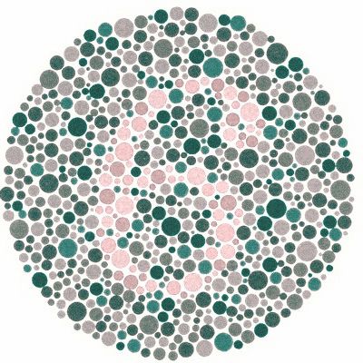
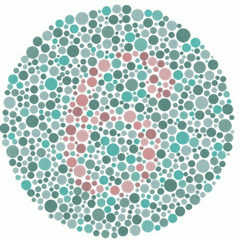

Ishihara_09
---

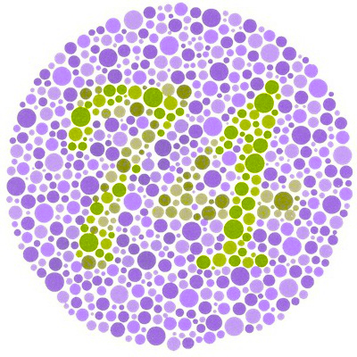
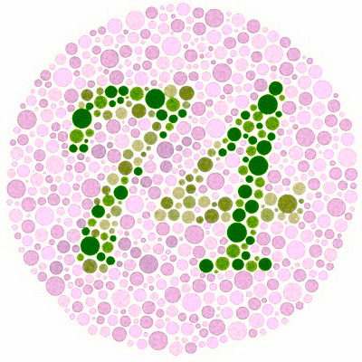
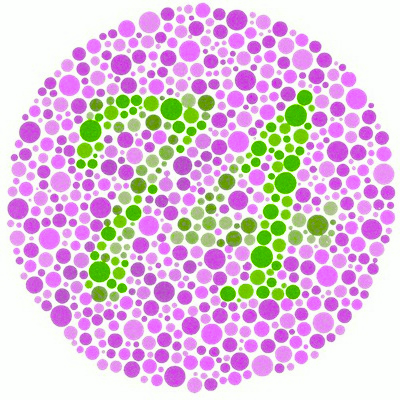
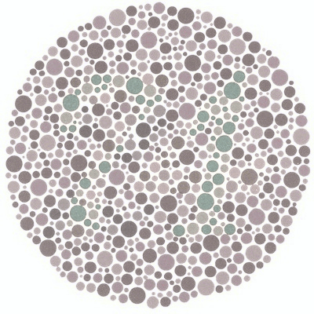
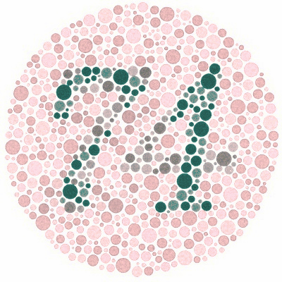
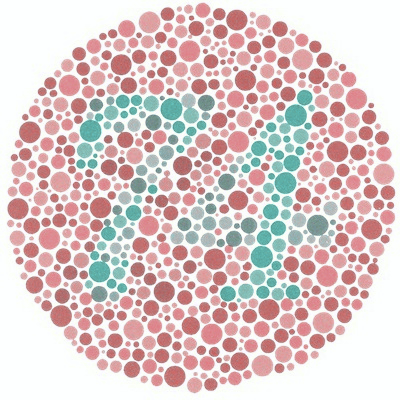

Ishihara_12
---

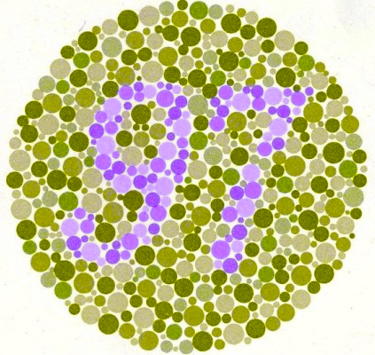
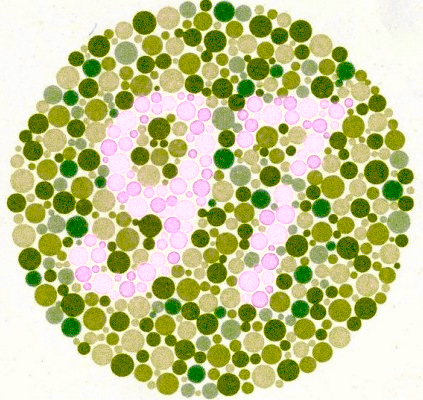
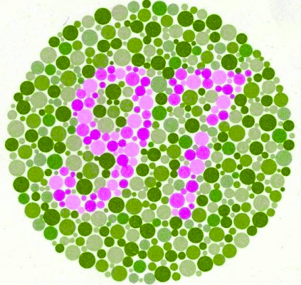
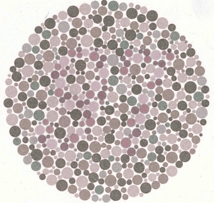
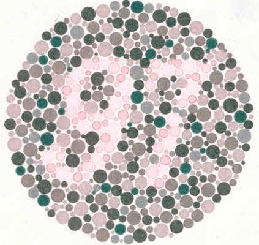
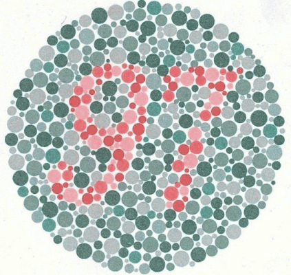

Ishihara_13
---

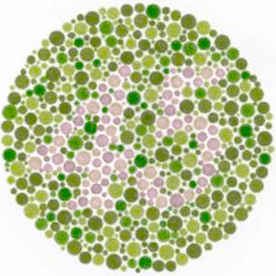

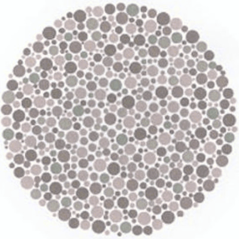
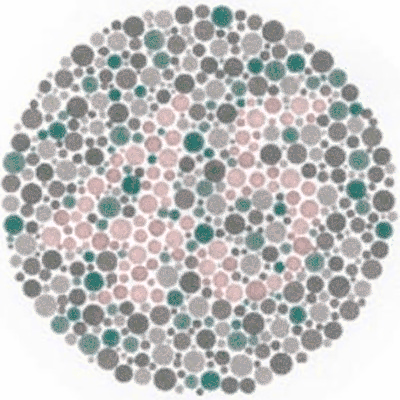

Ishihara_23
---

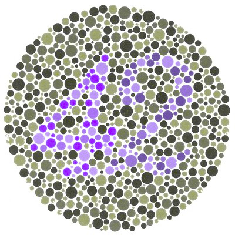

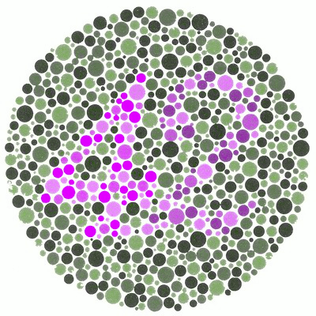
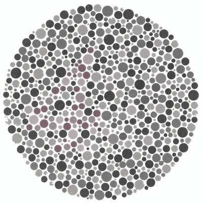
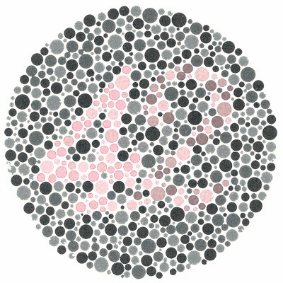
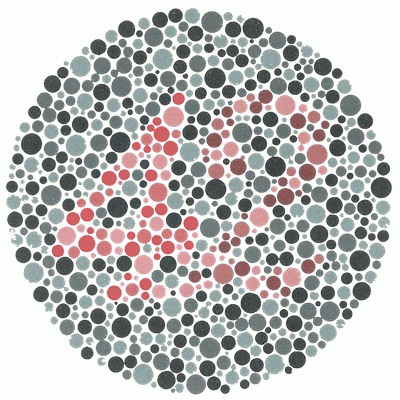

crop
---

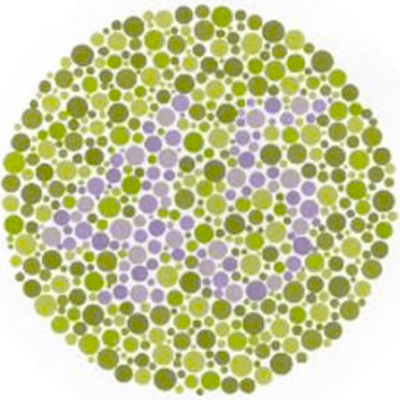

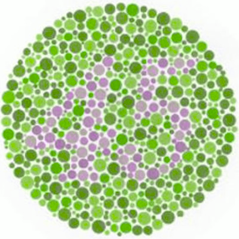

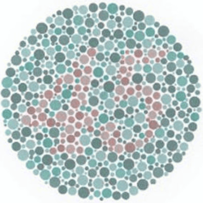

fall_trees
---

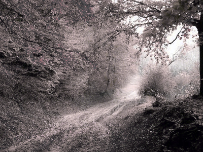
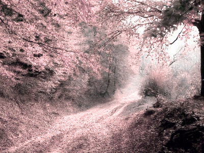
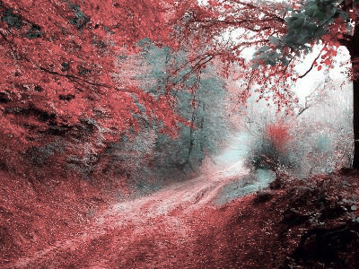

flower
---

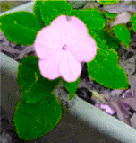

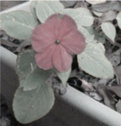
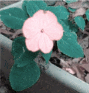
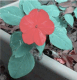

