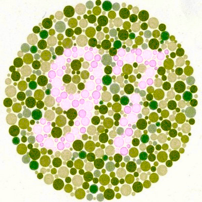
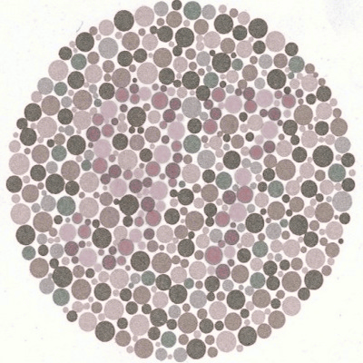
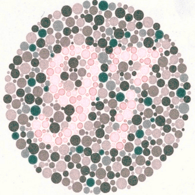
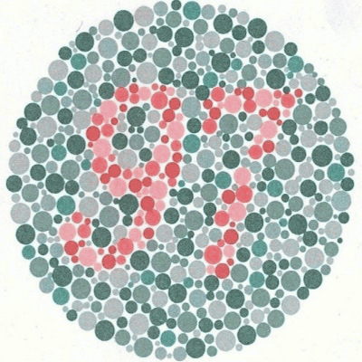
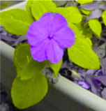

Results for Tritanopia
-------

From left to right: original, Daltonised (Fidaner), corrected (Willmott),
simulated colour blindness, Daltonised + simulated, corrected + simulated.

Ishihara_03
---

Ishihara_09
---

Ishihara_12
---

Ishihara_13
---

Ishihara_23
---

fall_trees
---

flower
---

